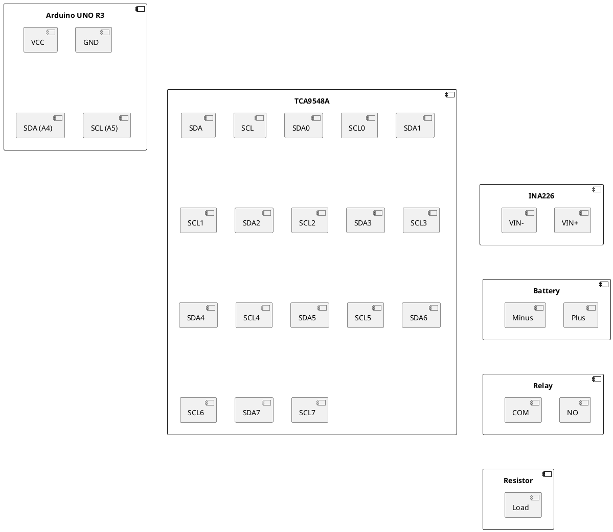

### Схема подключения:



#### Оборудование:
- Arduino UNO R3
- Мультиплексоры TCA9548A (по 8 каналов каждый)
- Датчики измерения тока INA226 (по 8 каналов каждый)
- Реле (100 штук для 100 аккумуляторов)
- Резисторы (нагрузка для каждого аккумулятора)
- Батареи (аккумуляторы)
- Соединительные провода

#### Схема подключения:

1. **Arduino UNO R3 к первому TCA9548A:**
   - VCC -> VCC (5V)
   - GND -> GND
   - SDA (A4) -> SDA
   - SCL (A5) -> SCL

2. **Между TCA9548A:**
   - Подключите дополнительные мультиплексоры параллельно по SDA и SCL шине.

3. **TCA9548A к датчикам INA226:**
   - VCC -> VCC
   - GND -> GND
   - SDA (для каждого канала): 
     - SDA0 -> INA226 (первый датчик) SDA
     - SDA1 -> INA226 (второй датчик) SDA
     - и т.д. до SDA7 (для восьми датчиков)
   - SCL (для каждого канала): 
     - SCL0 -> INA226 (первый датчик) SCL
     - SCL1 -> INA226 (второй датчик) SCL
     - и т.д. до SCL7 (для восьми датчиков)

4. **INA226 к аккумуляторам:**
   - VIN+ -> Плюс аккумулятора
   - VIN- -> Минус аккумулятора через контакт реле

5. **Реле к аккумуляторам и резисторам:**
   - Реле на каждом канале подключается следующим образом:
     - NO (Normally Open) -> Минус аккумулятора через резистор (нагрузка)
     - COM (Common) -> VIN- датчика INA226
   - Контролируемые сигналы реле подключены к цифровым выходам Arduino через расширители портов (например, с использованием нескольких MCP23017).

### Инструкция по сборке схемы

1. Подключите первый мультиплексор TCA9548A к Arduino UNO согласно указанным выше портам.
2. Подключите дополнительные мультиплексоры TCA9548A параллельно по шине SDA и SCL.
3. Подключите каждый датчик INA226 к соответствующим каналам TCA9548A.
4. Подключите аккумуляторы к датчикам INA226, как указано выше.
5. Подключите реле к аккумуляторам и резисторам, управляемым через цифровые выходы Arduino.
6. Используйте расширители портов (MCP23017) для управления большим количеством реле.

### Метод работы

1. **Снятие данных без нагрузки:**
   - Измерение напряжения на аккумуляторе без подключенного резистора (нагрузки).
   - Запись значений в массив.

2. **Снятие данных с нагрузкой:**
   - Включение реле для подключения резистора (нагрузки) к аккумулятору.
   - Измерение напряжения на аккумуляторе под нагрузкой.
   - Запись значений в массив.

3. **Расчет внутреннего сопротивления:**
   - Использование формулы внутреннего сопротивления \( R_{internal} = \frac{V_{no\_load} - V_{load}}{I_{load}} \), где \( V_{no\_load} \) - напряжение без нагрузки, \( V_{load} \) - напряжение под нагрузкой, \( I_{load} \) - ток под нагрузкой.

4. **Выбор аккумуляторов с одинаковым внутренним сопротивлением:**
   - Пользователь вводит необходимое количество аккумуляторов.
   - Программа выбирает аккумуляторы с наименьшим отклонением внутреннего сопротивления.

### Программа

```cpp
#include <Wire.h>
#include <Adafruit_INA226.h>
#include <Adafruit_TCA9548A.h>
#include <Adafruit_MCP23017.h>

// Создание объектов для мультиплексоров и датчиков INA226
Adafruit_TCA9548A tca = Adafruit_TCA9548A();
Adafruit_INA226 ina226[100]; // 100 датчиков
Adafruit_MCP23017 mcp; // Расширитель портов для управления реле

// Массив для хранения внутреннего сопротивления
float internalResistance[100];

// Пины для управления реле через MCP23017
int relayPins[100];

// Настройка мультиплексоров, датчиков и реле
void setup() {
  Serial.begin(9600);

  if (!tca.begin()) {
    Serial.println("Couldn't find TCA9548A!");
    while (1);
  }

  mcp.begin();      // Начинаем работу с MCP23017
  for (int i = 0; i < 16; i++) {
    mcp.pinMode(i, OUTPUT);
    mcp.digitalWrite(i, LOW); // Выключить реле (отключить нагрузку)
  }

  for (int i = 0; i < 100; i++) {
    int tcaChannel = i / 8;
    int sensorIndex = i % 8;
    
    tca.selectChannel(tcaChannel);
    if (!ina226[i].begin()) {
      Serial.print("Couldn't find INA226 on channel ");
      Serial.print(tcaChannel);
      Serial.print(", sensor ");
      Serial.println(sensorIndex);
      while (1);
    }
    ina226[i].setCalibration_16V_400mA();
    tca.disableChannel(tcaChannel);
    
    relayPins[i] = i % 16;  // Назначение пинов для реле через MCP23017
  }
}

// Функция измерения напряжения и тока
void measureBattery(int index, float &voltage, float &current) {
  int tcaChannel = index / 8;
  tca.enableChannel(tcaChannel);
  voltage = ina226[index].readBusVoltage();
  current = ina226[index].readCurrent();
  tca.disableChannel(tcaChannel);
}

void loop() {
  float noLoadVoltage[100];
  float loadVoltage[100];
  float loadCurrent[100];
  float resistorValue = 1.0; // Сопротивление резистора в Ом

  // Снятие данных без нагрузки
  for (int i = 0; i < 100; i++) {
    measureBattery(i, noLoadVoltage[i], loadCurrent[i]);
  }

  // Включить реле для каждого аккумулятора (подключить нагрузку)
  for (int i = 0; i < 100; i++) {
    mcp.digitalWrite(relayPins[i], HIGH);
    delay(100); // Небольшая задержка для стабилизации
  }

  // Снятие данных с нагрузкой
  for (int i = 0; i < 100; i++) {
    measureBattery(i, loadVoltage[i], loadCurrent[i]);
  }

  // Выключить реле (отключить нагрузку)
  for (int i = 0; i < 100; i++) {
    mcp.digitalWrite(relayPins[i], LOW);
  }

  // Расчет внутреннего сопротивления
  for (int i = 0; i < 100; i++) {
    internalResistance[i] = (noLoadVoltage[i] - loadVoltage[i]) / loadCurrent[i];
  }

  // Вывод результатов
  for (int i = 0; i < 100; i++) {
    Serial.print("Battery ");
    Serial.print(i);
    Serial.print(": Internal Resistance = ");
    Serial.print(internalResistance[i]);
    Serial.println(" ohms");
  }

  delay(10000); // Пауза перед следующим измерением
}
```

### Объяснение

1. **Подключение реле:** Реле управляются с помощью расширителя портов MCP23017, который позволяет управлять большим количеством реле.
2. **Снятие данных без нагрузки:** Сначала измеряем напряжение и ток без подключенной нагрузки.
3. **Снятие данных с нагрузкой:** Включаем реле через MCP23017, чтобы подключить нагрузку, и снова измеряем напряжение и ток.
4. **Расчет внутреннего сопротивления:** Используем измеренные данные для расчета внутреннего сопротивления аккумуляторов.
5. **Автоматическое измерение:** Программа автоматически управляет реле и проводит все измерения без необходимости ручного вмешательства.

### Масштабирование системы

Для масштабирования системы до сотни или более аккумуляторов необходимо добавить больше мультиплексоров TCA9548A и соответствующее количество датчиков INA226. Расширители портов MCP23017 позволят управлять большим количеством реле, необходимыми для каждой батареи. Программное обеспечение может быть обновлено для поддержки дополнительного оборудования и управления им через дополнительные каналы и расширители портов.
